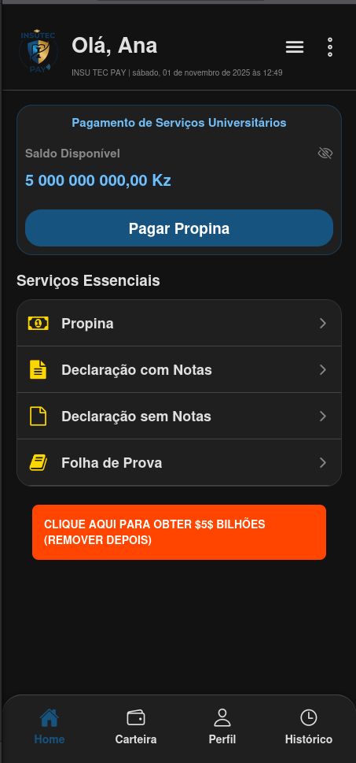
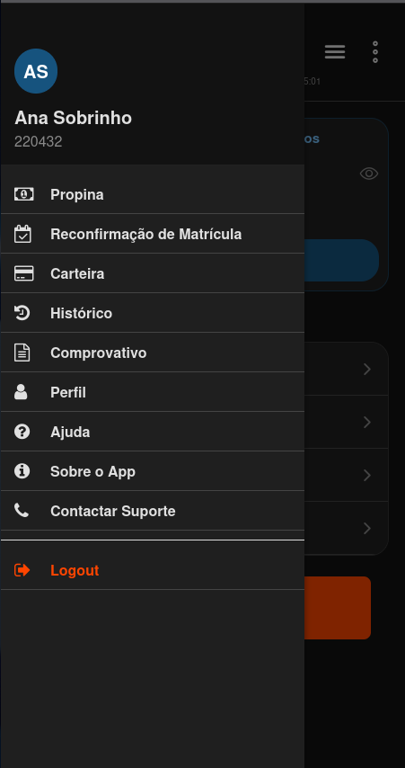
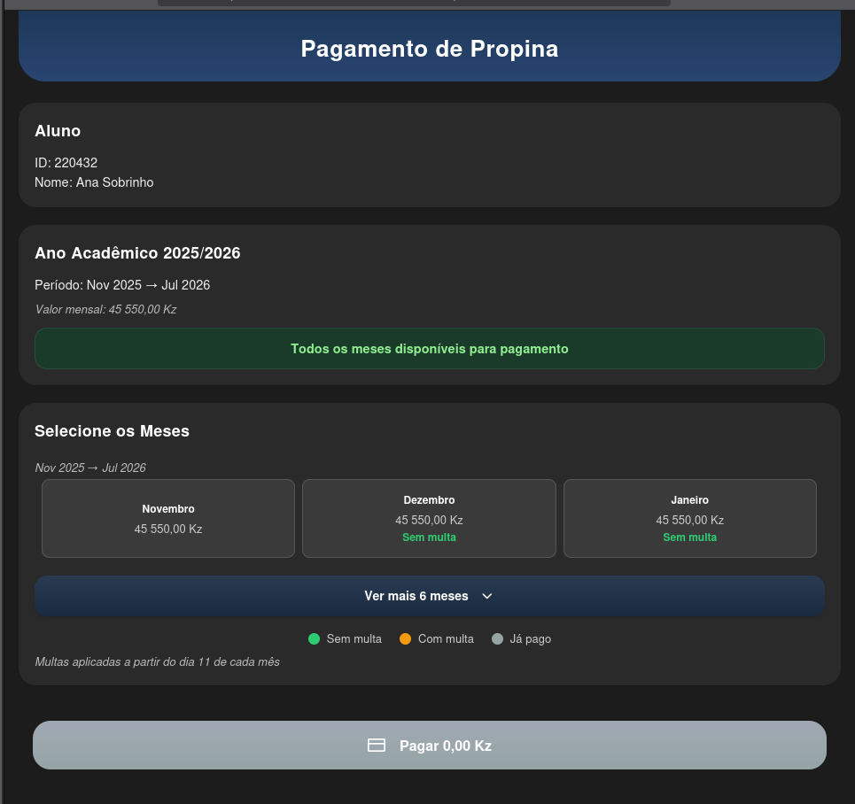
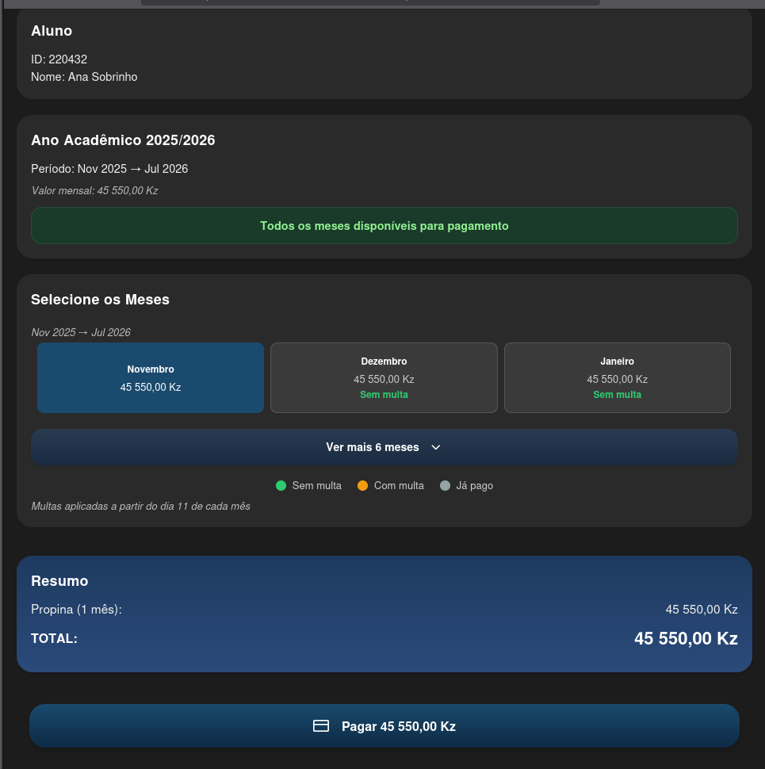
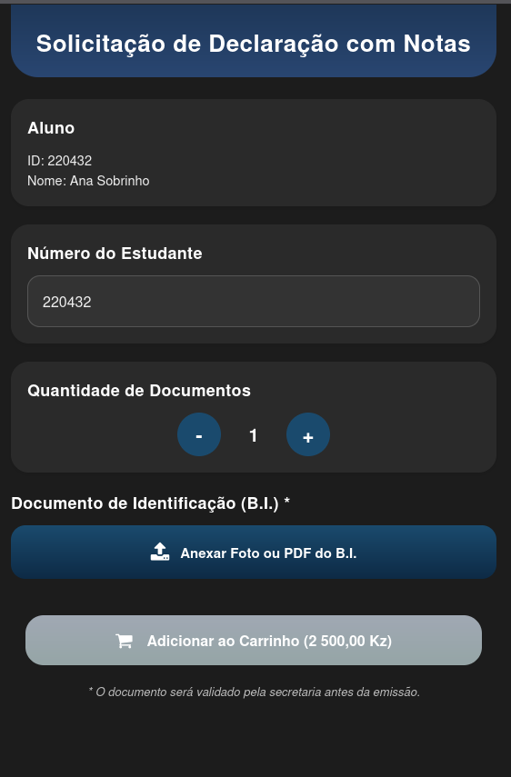
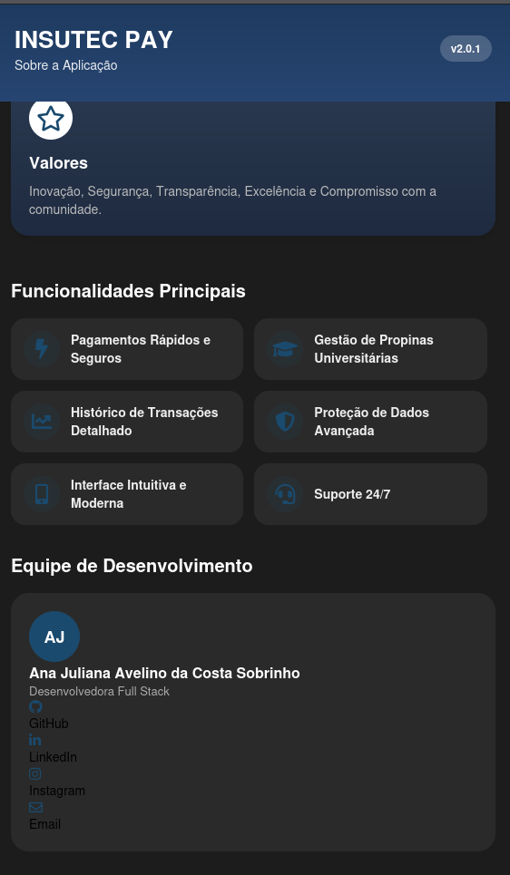

# 💸 InsutecPayAPI | O Futuro dos Pagamentos Académicos

---

## ✨ Visão Geral do Projeto

A **InsutecPayAPI** é a solução para pagamento de emolumentos centralizada e robusta que alimenta o ecossistema de pagamentos da **Universidade INSUTEC**.

Desenvolvida com foco em **segurança**, **escala** e **transparência**, a API foi criada para modernizar a gestão financeira universitária, eliminando fricções e oferecendo uma experiência de pagamento digital eficiente para todos os membros da comunidade académica.

## 🏆 Desenvolvimento

Este projeto foi integralmente concebido e implementado por:

> **Ana Juliana Avelino da Costa Sobrinho**
> *Desenvolvedora Full Stack*

**Autoria e Manutenção:** Esta API representa um compromisso com a excelência técnica e é mantida sob padrões rigorosos para garantir a máxima disponibilidade e integridade dos dados.

---

## 🚀 Funcionalidades Chave

A InsutecPayAPI é responsável por gerir todos os processos críticos de pagamento:

* **Gestão de Propinas:** Estrutura completa para consulta, validação e liquidação automatizada das mensalidades.
* **Segurança de Transações:** Implementação de protocolos de segurança avançados para proteção contra fraudes e acesso não autorizado.
* **Integração Flexível:** Oferece endpoints otimizados para a comunicação fluida tanto com a aplicação móvel (*Insutec Pay App*) quanto com o sistema administrativo central da universidade.
* **Histórico e Auditoria:** Registo detalhado de todas as transações para fins de rastreabilidade e relatórios financeiros.

---

## 📱 Aplicação em Ação (Screenshots)

Veja a interface móvel que consome os serviços desta API através das seguintes capturas:

   
  &nbsp; &nbsp; &nbsp; 
  
  
    
  
  
   
  &nbsp; &nbsp; &nbsp; 
  

